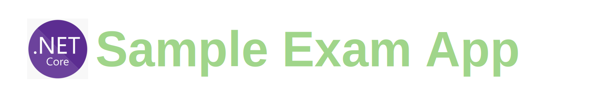

# 
> ### ASP.NET Core webapi template based API for sample exam application.

# Getting started

## Debugging

- Run app by executing `start` task.

- Attach dedugger to running app in Visual Studio Code  via `.NET Core Attach`  launch configuration.

